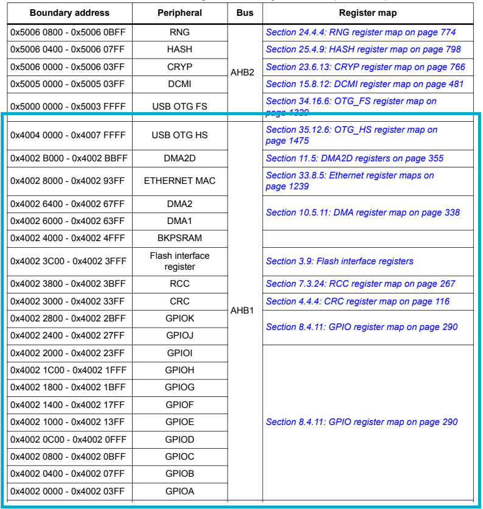
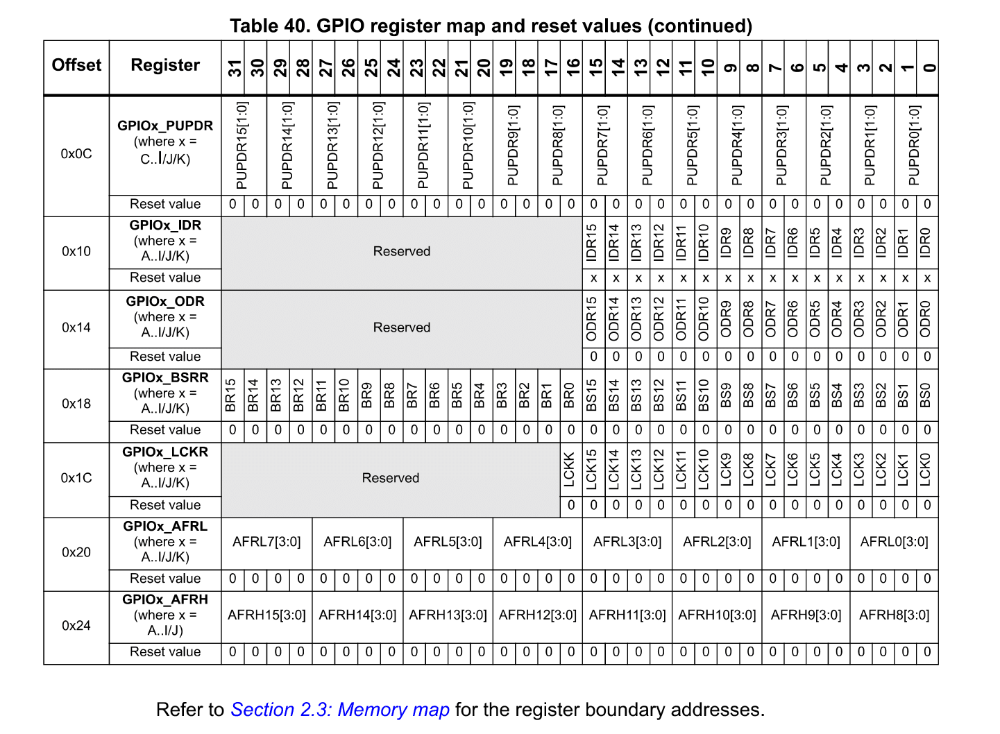
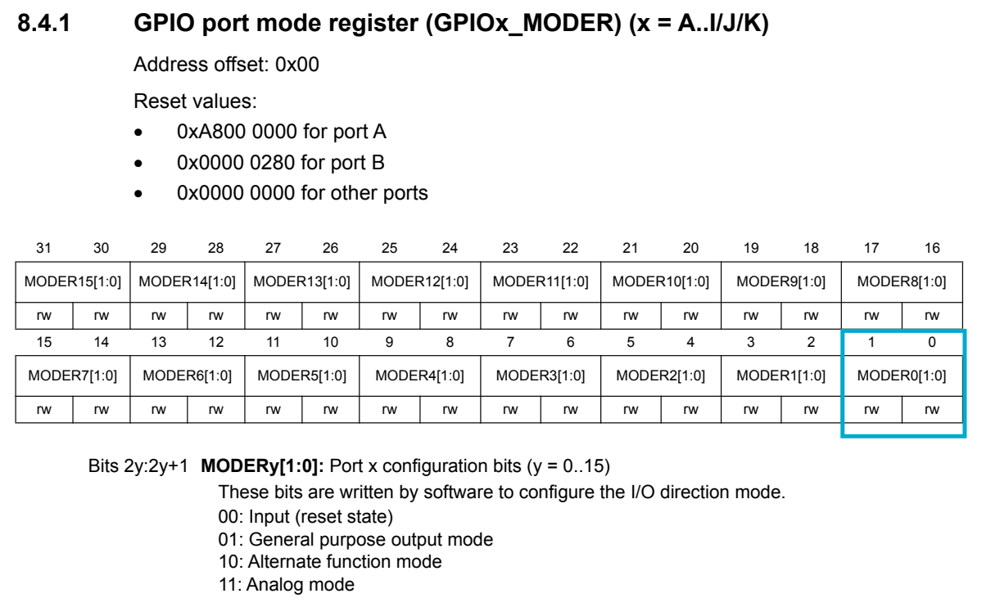
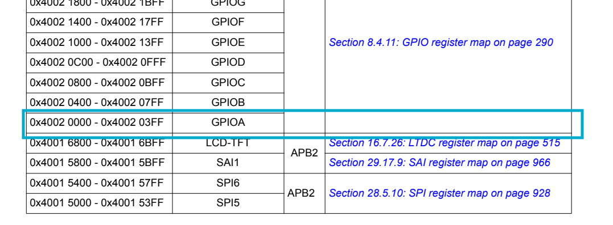
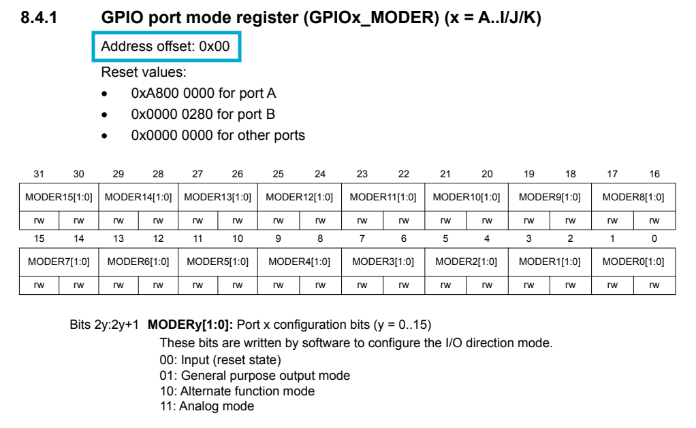
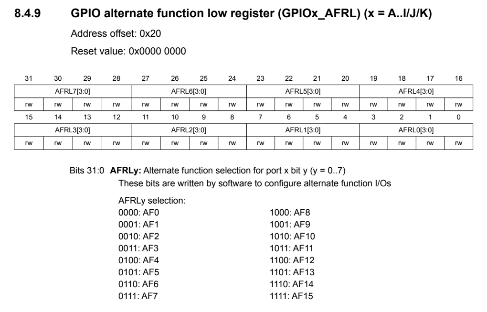
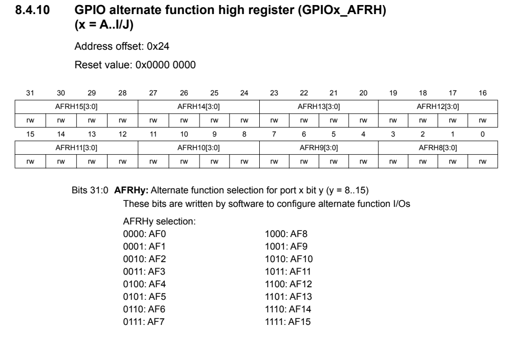
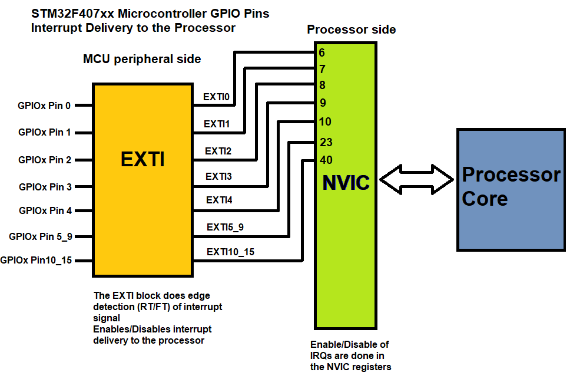

# 🚀 STM32 Bare Metal Programming Guide

> A comprehensive guide to programming STM32F407 microcontroller from scratch without HAL libraries

## 📋 Table of Contents

- [Overview](#-overview)
- [Project Structure](#-project-structure)
- [Documentation](#-documentation)
- [Memory Map And Registers](#-memory-map-and-registers)
- [Implemented Peripherals](#-implemented-peripherals)
    - [How to access peripheral registers?](#how-to-access-peripheral-registers)
    - [Clock control](#clock-control)
    - [Structure Definitions](#structure-definitions)
    - [GPIO (General Purpose Input/Output)](#gpio-general-purpose-inputoutput)
        - [User configurable structure:](#user-configurable-structure)
        - [Structure GPIO_typeDef:](#structure-gpio_typedef)
        - [GPIO Initialization Function:](#gpio-initialization-function)
        - [GPIO_INIT](#gpio_init)
        - [Handling External Interrupts (EXTI)](#handling-external-interrupts-exti)

## 🎯 Overview

This project demonstrates bare metal programming techniques for the STM32F407 microcontroller. Instead of relying on STM32 HAL (Hardware Abstraction Layer) libraries, this implementation provides direct register manipulation to understand the underlying hardware operations.

**Key Features:**
- ✅ Custom GPIO driver with multiple modes support
- ✅ Full I2C implementation (Master/Slave modes)
- ✅ External interrupt handling (EXTI)
- ✅ Interrupt-driven I2C communication
- ✅ Clock configuration and management
- ✅ Comprehensive error handling

## 📁 Project Structure

```
Protocols/
├── Drivers/
│   ├── Inc/
│   │   ├── stm32f4xx_cus.h           # Main header with common definitions
│   │   ├── stm32f4xx_cus_gpio.h      # GPIO driver header
│   │   ├── stm32f4xx_cus_i2c.h       # I2C driver header
│   │   └── stm32f4xx_cus_clock.h     # Clock management header
│   └── Src/
│       ├── stm32f4xx_cus_gpio.c      # GPIO driver implementation
│       ├── stm32f4xx_cus_i2c.c       # I2C driver implementation
│       └── stm32f4xx_cus_clock.c     # Clock management implementation
├── Inc/
│   └── main.h                        # Main application header
├── Src/
│   └── main.c                        # Main application (example)

Docs/
├── ReferenceManual.pdf               # STM32F4 reference manual
└── Datasheet.pdf                     # STM32F4 device datasheet

README.md
```

## Documentation

In the Docs/ folder, you will find the Reference Manual and Datasheet for the STM32F407 microcontroller. These documents are essential resources for working with the chip:

- Reference Manual → Describes the microcontroller’s internal architecture, memory map, and detailed registers. It is primarily used when configuring and controlling peripherals.

- Datasheet → Provides an overview of the device, including electrical characteristics, package details, pinout, and key features.

## 🗺️ Memory Map And Registers

The memory map is a map of the memory regions that are available in the microcontroller.

The memory map is divided into different memory regions through <strong>bus interfaces: AHB1, AHB2...</strong>

Each <strong>bus interfaces</strong> is connected to the <strong>different peripherals</strong> of the microcontroller.

At you can see in the image below, the AHB1 bus interface is connected to the <strong>GPIO peripherals</strong>: GPIOA, GPIOB, GPIOC, GPIOD...



In each peripheral, there are different registers that control the peripheral's behavior.

For example, in the GPIO peripheral, there are registers like MODER, OTYPER, OSPEEDR, PUPDR, IDR, ODR...



In each register, there are 32 bits that control specific functionalities of the peripheral.

The following image shows the MODER register of the GPIO peripheral. for example, MODER1 control the mode of the pin 1 of the GPIO. It can be configured as input, output, alternate function, or analog mode by control bit 1 and bit 0.



## 🔧 Implemented Peripherals

### How to access peripheral registers?

To access peripheral registers, we need to know the base address of the peripheral and the offset of the register we want to access.

For example, the base address of GPIOA is `0x40020000`.



The offset of the MODER register is `0x00`.



So, the address of the MODER register of GPIOA is `0x40020000 + 0x00 = 0x40020000`.

And we can access the MODER register of GPIOA using a pointer:

```c
#define GPIOA_BASEADDR 0x40020000U
#define GPIOA_MODER_OFFSET 0x00U
#define GPIOA_MODER (*(volatile uint32_t *)(GPIOA_BASEADDR + GPIOA_MODER_OFFSET))
```
Now, we can read or write to the MODER register of GPIOA using the `GPIOA_MODER` macro.

```c
// Set pin 0 of GPIOA as output
GPIOA_MODER |= (1 << 0); // Set bit 0 to 1
GPIOA_MODER &= ~(1 << 1); // Set bit 1 to 0
```

### Clock control

Just like operating a car requires starting the engine and powering up the entire system first, using GPIO or any other peripheral on a microcontroller requires enabling the clock to “start” them.

If you want to use GPIOA, you need to enable the clock for GPIOA in the RCC (Reset and Clock Control) peripheral.


In the image above, you can see that bit 0 of the RCC_AHB1ENR register enables the clock for GPIOA. So, to enable the clock for GPIOA, we need to set bit 0 of the RCC_AHB1ENR register.

```c
#define RCC_BASEADDR 0x40023800U
#define RCC_AHB1ENR_OFFSET 0x30U
#define RCC_AHB1ENR (*(volatile uint32_t *)(RCC_BASEADDR + RCC_AHB1ENR_OFFSET))
#define RCC_AHB1ENR_GPIOA_EN (1 << 0) // Bit 0 enables clock for GPIOA

int main(void) {
    // Enable clock for GPIOA
    RCC_AHB1ENR |= RCC_AHB1ENR_GPIOA_EN;

    // Now you can use GPIOA
}
```

### Structure Definitions

As of now, you may have noticed that we are using macros to access peripheral registers. While this method works, it can become cumbersome and error-prone as the project grows.

To improve code readability and maintainability, we can define structures that represent the peripheral registers. This way, we can access the registers using structure members instead of macros.

For example, we can define a structure for the GPIO peripheral as follows:

```c
typedef struct {
    volatile uint32_t MODER;    // GPIO port mode register
    volatile uint32_t OTYPER;   // GPIO port output type register
    volatile uint32_t OSPEEDR;  // GPIO port output speed register
    volatile uint32_t PUPDR;    // GPIO port pull-up/pull-down register
    volatile uint32_t IDR;      // GPIO port input data register
    volatile uint32_t ODR;      // GPIO port output data register
    volatile uint32_t BSRR;     // GPIO port bit set/reset register
    volatile uint32_t LCKR;     // GPIO port configuration lock register
    volatile uint32_t AFR[2];   // GPIO alternate function registers
} GPIO_TypeDef;
```

Then, we can define a pointer to the GPIOA peripheral as follows:

```c
#define GPIOA_BASEADDR 0x40020000U
#define GPIOA ((GPIO_TypeDef *)GPIOA_BASEADDR)
```

Here’s what this means:

- GPIOA_BASEADDR: This is the base memory address of the GPIOA peripheral.

- GPIOA: This macro takes the base address, casts it to a pointer of type GPIO_TypeDef, and allows us to treat it as a structure.

By doing this, GPIOA becomes a pointer to the GPIO_TypeDef structure. This lets us access the registers of GPIOA directly through structure members (e.g., GPIOA->MODER, GPIOA->ODR, etc.) instead of working with raw memory addresses.

Now, we can access the MODER register of GPIOA using the structure member:

```c
// Set pin 0 of GPIOA as output
GPIOA->MODER |= (1 << 0); // Set bit 0 to 1
GPIOA->MODER &= ~(1 << 1); // Set bit 1 to 0
```

### GPIO (General Purpose Input/Output)

The GPIO driver provides comprehensive pin control with support for:

**Features Implemented:**
- Multiple pin modes (Input, Output, Alternate Function, Analog)
- Pull-up/Pull-down resistor configuration
- Output speed control (Low, Medium, High, Very High)
- Output type selection (Push-Pull, Open-Drain)
- Alternate function mapping
- External interrupt configuration

**Key Functions:**
```c
void GPIO_INIT(GPIO_Handle_TypeDef *gpioHandle);
uint8_t GPIO_INPUT(GPIO_TypeDef *gpiox, uint8_t gpio_pins);
void GPIO_OUTPUT(GPIO_TypeDef *gpiox, uint8_t gpio_pins, uint8_t val);
void GPIO_TOGGLE(GPIO_TypeDef *gpiox, uint8_t gpio_pins);
```

#### User configurable structure:

To make the GPIO driver flexible and user-friendly, a configuration structure is defined. This structure allows users to specify the desired settings for each GPIO pin.

This structure is defined in the `stm32f4xx_cus_gpio.h` file as follows:

```c
typedef struct {
	GPIO_TypeDef *GPIOX;
	uint8_t pin_number;
	uint8_t mode;
	uint8_t pull_up_pull_down;
	uint8_t output_speed;
	uint8_t output_type;
	uint8_t alternate_function_select;
	uint8_t exti_select;
} GPIO_Handle_TypeDef;
```

#### Structure GPIO_typeDef:

The `GPIO_TypeDef` structure represents the GPIO peripheral registers. It is defined in the `stm32f4xx_cus.h` file as follows:

```c
typedef struct {
    volatile uint32_t MODER;    // GPIO port mode register
    volatile uint32_t OTYPER;   // GPIO port output type register
    volatile uint32_t OSPEEDR;  // GPIO port output speed register
    volatile uint32_t PUPDR;    // GPIO port pull-up/pull-down register
    volatile uint32_t IDR;      // GPIO port input data register
    volatile uint32_t ODR;      // GPIO port output data register
    volatile uint32_t BSRR;     // GPIO port bit set/reset register
    volatile uint32_t LCKR;     // GPIO port configuration lock register
    volatile uint32_t AFR[2];   // GPIO alternate function registers
} GPIO_TypeDef;
```

We also define macros for GPIO base addresses:

```c
// This is pointer type GPIO_TypeDef
#define AHB1_BASE_ADDR    0x40020000UL
#define GPIO_OFFSET_ADDR  0x400UL
#define GPIOA ((GPIO_TypeDef*)(AHB1_BASE_ADDR + (0 * GPIO_OFFSET_ADDR)))
#define GPIOB ((GPIO_TypeDef*)(AHB1_BASE_ADDR + (1 * GPIO_OFFSET_ADDR)))
#define GPIOC ((GPIO_TypeDef*)(AHB1_BASE_ADDR + (2 * GPIO_OFFSET_ADDR)))
#define GPIOD ((GPIO_TypeDef*)(AHB1_BASE_ADDR + (3 * GPIO_OFFSET_ADDR)))
#define GPIOE ((GPIO_TypeDef*)(AHB1_BASE_ADDR + (4 * GPIO_OFFSET_ADDR)))
#define GPIOF ((GPIO_TypeDef*)(AHB1_BASE_ADDR + (5 * GPIO_OFFSET_ADDR)))
#define GPIOG ((GPIO_TypeDef*)(AHB1_BASE_ADDR + (6 * GPIO_OFFSET_ADDR)))
#define GPIOH ((GPIO_TypeDef*)(AHB1_BASE_ADDR + (7 * GPIO_OFFSET_ADDR)))
#define GPIOI ((GPIO_TypeDef*)(AHB1_BASE_ADDR + (8 * GPIO_OFFSET_ADDR)))
#define GPIOJ ((GPIO_TypeDef*)(AHB1_BASE_ADDR + (9 * GPIO_OFFSET_ADDR)))
#define GPIOK ((GPIO_TypeDef*)(AHB1_BASE_ADDR + (10 * GPIO_OFFSET_ADDR)))
```

Other macros for pin numbers, modes, output types, speeds, pull-up/pull-down configurations, and alternate functions are defined in `stm32f4xx_cus_gpio.h`.

#### GPIO Initialization Function:

##### GPIO_INIT

The `GPIO_INIT` function initializes a GPIO pin based on the configuration provided in the `GPIO_Handle_TypeDef` structure. It performs the following steps:

1. Enables the clock for the specified GPIO port.
2. Configures the pull-up/pull-down resistors first because they are independent of the mode.
3. Configures mode (Input, Output, Alternate Function, Analog).
4. Handles external interrupt configuration if applicable.

First we enable the clock for the GPIO port from the GPIO_Handle_TypeDef structure.

```c
if (gpioHandle->GPIOX == GPIOA) {
		GPIOA_EN();
	}
// Similarly for other GPIO ports...
```

Then we configure the pull-up/pull-down resistors and reset the mode bits.

```c
// Reset mode
	gpioHandle->GPIOX->MODER &= ~(GPIO_BIT_11_Mask
			<< (Shift_2_pos * gpioHandle->pin_number));

	// Pull-up or Pull-down
	gpioHandle->GPIOX->PUPDR &= ~(GPIO_BIT_11_Mask
			<< (Shift_2_pos * gpioHandle->pin_number));

	gpioHandle->GPIOX->PUPDR |= (gpioHandle->pull_up_pull_down
			<< (Shift_2_pos * gpioHandle->pin_number));
```
Similarly, we configure the mode, output type, speed, and alternate function if applicable.

STM32F407 contains AFR[0] (AFRL) and AFR[1] (AFRH) registers for alternate function selection. AFR[0] is for pins 0-7, and AFR[1] is for pins 8-15.





To determine which AFR register to use, we can use the following logic:

```c
uint8_t ALT_low_high = (gpioHandle->pin_number / 8);
```

For example: if pin_number is 5, then 5/ 8 = 0, so we use AFR[0]. If pin_number is 10, then 10 / 8 = 1, so we use AFR[1].

Similarly, to determine the position of the pin in the AFR register, we can use:

```c
uint8_t ALT_pos = (gpioHandle->pin_number % 8);
```

For example: if pin_number is 5, then 5 % 8 = 5, so we use position 5 in AFR[0]. If pin_number is 10, then 10 % 8 = 2, so we use position 2 in AFR[1].

Finally, we can configure the alternate function as follows:

```c
// Reset first
gpioHandle->GPIOX->AFR[ALT_low_high] &= ~(11
					<< gpioHandle->pin_number);

// Set the alternate function
gpioHandle->GPIOX->AFR[ALT_low_high] |= (gpioHandle->alternate_function_select
                    << (Shift_4_pos * ALT_pos));
```

##### Handling External Interrupts (EXTI)

If the GPIO pin is configured for external interrupts, we need to configure the EXTI and SYSCFG registers accordingly.



GPIO pins can be mapped to EXTI lines. For example, pin 0 of any GPIO port can be mapped to EXTI line 0, pin 1 to EXTI line 1, and so on.

To configure the EXTI line for a specific GPIO pin, we need to:
1. Enable the SYSCFG clock.
2. Configure the rising/falling edge trigger in the EXTI registers.
3. Configure the SYSCFG_EXTICR register to map the GPIO pin to the EXTI line.
4. Enable the EXTI line in the IMR register by configuring the interrupt mask.

```c
// 1.Enable SYSCFG clock
SYSCFG_EN();

// 2. Configuration RISING/FALLING or RISING AND FALLING
    if (gpioHandle->mode == GPIO_MODE_INTERRUPT_CHANGE) {
        EXTI->RTSR &= ~(HIGH << gpioHandle->pin_number);
        EXTI->FTSR &= ~(HIGH << gpioHandle->pin_number);
        EXTI->RTSR |= (HIGH << gpioHandle->pin_number);
        EXTI->FTSR |= (HIGH << gpioHandle->pin_number);
    } else if (gpioHandle->mode == GPIO_MODE_INTERRUPT_FALLING) {
        EXTI->FTSR &= ~(HIGH << gpioHandle->pin_number);
        EXTI->FTSR |= (HIGH << gpioHandle->pin_number);
    } else if (gpioHandle->mode == GPIO_MODE_INTERRUPT_RISING) {
        EXTI->RTSR &= ~(HIGH << gpioHandle->pin_number);
        EXTI->RTSR |= (HIGH << gpioHandle->pin_number);
    }

// 3. Configure SYSCFG_EXTICR
    uint8_t cal_reg = (gpioHandle->pin_number / 4);
    uint8_t cal_bit = (gpioHandle->pin_number % 4);
    SYSCFG->EXTICR[cal_reg] |= (gpioHandle->exti_select << 4 * cal_bit);

// 4. Enable EXTI line in IMR
    EXTI->IMR |= (HIGH << gpioHandle->pin_number);
```

**What I Learned:**
- Understanding GPIO register structure (MODER, OTYPER, OSPEEDR, PUPDR, etc.)
- Bit manipulation techniques for register configuration
- Clock enabling for peripheral operation
- Alternate function selection and mapping