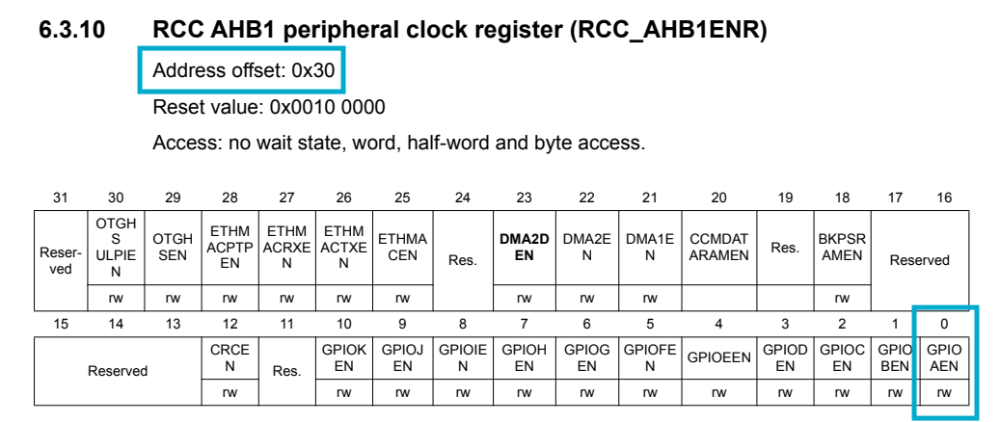

# 🚀 STM32 Bare Metal Programming Guide

> A comprehensive guide to programming STM32F407 microcontroller from scratch without HAL libraries

## 📋 Table of Contents

- [Overview](#-overview)
- [Project Structure](#-project-structure)
- [Documentation](#-documentation)
- [Memory Map And Registers](#-memory-map-and-registers)
- [Accessing Peripheral Registers](#-accessing-peripheral-registers)
  - [How to access peripheral registers?](#how-to-access-peripheral-registers)
  - [Clock control](#clock-control)
  - [Structure Definitions](#structure-definitions)
- [GPIO (General Purpose Input/Output)](#gpio-general-purpose-inputoutput)
  - [User configurable structure](#user-configurable-structure)
  - [Structure GPIO_typeDef](#structure-gpio_typedef)
  - [GPIO Initialization Function](#gpio-initialization-function)
    - [GPIO_INIT](#gpio_init)
    - [Handling External Interrupts (EXTI)](#handling-external-interrupts-exti)
  - [What I Learned](#what-i-learned)
- [I2C (Inter-Integrated Circuit)](#i2c-inter-integrated-circuit)
  - [User configurable structure](#user-configurable-structure-1)
  - [Structure I2C_typeDef](#structure-i2c_typedef)
  - [I2C Initialization Function](#i2c-initialization-function)
  - [I2C Master Write Function](#i2c-master-write-function)
  - [I2C Master Read Function](#i2c-master-read-function)
  - [I2C Master Write Interrupt Function](#i2c-master-write-interrupt-function)
  - [I2C Master Read Interrupt Function](#i2c-master-read-interrupt-function)

## 🎯 Overview

This project demonstrates bare metal programming techniques for the STM32F407 microcontroller. Instead of relying on STM32 HAL (Hardware Abstraction Layer) libraries, this implementation provides direct register manipulation to understand the underlying hardware operations.

**Key Features:**

- ✅ Custom GPIO driver with multiple modes support
- ✅ Full I2C implementation (Master/Slave modes)
- ✅ External interrupt handling (EXTI)
- ✅ Interrupt-driven I2C communication
- ✅ Clock configuration and management
- ✅ Comprehensive error handling

## 📁 Project Structure

```
Protocols/
├── Drivers/
│   ├── Inc/
│   │   ├── stm32f4xx_cus.h           # Main header with common definitions
│   │   ├── stm32f4xx_cus_gpio.h      # GPIO driver header
│   │   ├── stm32f4xx_cus_i2c.h       # I2C driver header
│   │   └── stm32f4xx_cus_clock.h     # Clock management header
│   └── Src/
│       ├── stm32f4xx_cus_gpio.c      # GPIO driver implementation
│       ├── stm32f4xx_cus_i2c.c       # I2C driver implementation
│       └── stm32f4xx_cus_clock.c     # Clock management implementation
├── Inc/
│   └── main.h                        # Main application header
├── Src/
│   └── main.c                        # Main application (example)

Docs/
├── ReferenceManual.pdf               # STM32F4 reference manual
└── Datasheet.pdf                     # STM32F4 device datasheet

README.md
```

## 📄 Documentation

In the Docs/ folder, you will find the Reference Manual and Datasheet for the STM32F407 microcontroller. These documents are essential resources for working with the chip:

- Reference Manual → Describes the microcontroller’s internal architecture, memory map, and detailed registers. It is primarily used when configuring and controlling peripherals.

- Datasheet → Provides an overview of the device, including electrical characteristics, package details, pinout, and key features.

## 📝 Memory Map And Registers

The memory map is a map of the memory regions that are available in the microcontroller.

The memory map is divided into different memory regions through <strong>bus interfaces: AHB1, AHB2...</strong>

Each <strong>bus interfaces</strong> is connected to the <strong>different peripherals</strong> of the microcontroller.

At you can see in the image below, the AHB1 bus interface is connected to the <strong>GPIO peripherals</strong>: GPIOA, GPIOB, GPIOC, GPIOD...


In each peripheral, there are different registers that control the peripheral's behavior.

For example, in the GPIO peripheral, there are registers like MODER, OTYPER, OSPEEDR, PUPDR, IDR, ODR...


In each register, there are 32 bits that control specific functionalities of the peripheral.

The following image shows the MODER register of the GPIO peripheral. for example, MODER1 control the mode of the pin 1 of the GPIO. It can be configured as input, output, alternate function, or analog mode by control bit 1 and bit 0.


## 🔧 Accessing Peripheral Registers

### How to access peripheral registers?

To access peripheral registers, we need to know the base address of the peripheral and the offset of the register we want to access.

For example, the base address of GPIOA is `0x40020000`.


The offset of the MODER register is `0x00`.


So, the address of the MODER register of GPIOA is `0x40020000 + 0x00 = 0x40020000`.

And we can access the MODER register of GPIOA using a pointer:

```c
#define GPIOA_BASEADDR 0x40020000U
#define GPIOA_MODER_OFFSET 0x00U
#define GPIOA_MODER (*(volatile uint32_t *)(GPIOA_BASEADDR + GPIOA_MODER_OFFSET))
```

Now, we can read or write to the MODER register of GPIOA using the `GPIOA_MODER` macro.

```c
// Set pin 0 of GPIOA as output
GPIOA_MODER |= (1 << 0); // Set bit 0 to 1
GPIOA_MODER &= ~(1 << 1); // Set bit 1 to 0
```

### Clock control

Just like operating a car requires starting the engine and powering up the entire system first, using GPIO or any other peripheral on a microcontroller requires enabling the clock to “start” them.

If you want to use GPIOA, you need to enable the clock for GPIOA in the RCC (Reset and Clock Control) peripheral.



In the image above, you can see that bit 0 of the RCC_AHB1ENR register enables the clock for GPIOA. So, to enable the clock for GPIOA, we need to set bit 0 of the RCC_AHB1ENR register.

```c
#define RCC_BASEADDR 0x40023800U
#define RCC_AHB1ENR_OFFSET 0x30U
#define RCC_AHB1ENR (*(volatile uint32_t *)(RCC_BASEADDR + RCC_AHB1ENR_OFFSET))
#define RCC_AHB1ENR_GPIOA_EN (1 << 0) // Bit 0 enables clock for GPIOA

int main(void) {
    // Enable clock for GPIOA
    RCC_AHB1ENR |= RCC_AHB1ENR_GPIOA_EN;

    // Now you can use GPIOA
}
```

### Structure Definitions

As of now, you may have noticed that we are using macros to access peripheral registers. While this method works, it can become cumbersome and error-prone as the project grows.

To improve code readability and maintainability, we can define structures that represent the peripheral registers. This way, we can access the registers using structure members instead of macros.

For example, we can define a structure for the GPIO peripheral as follows:

```c
typedef struct {
    volatile uint32_t MODER;    // GPIO port mode register
    volatile uint32_t OTYPER;   // GPIO port output type register
    volatile uint32_t OSPEEDR;  // GPIO port output speed register
    volatile uint32_t PUPDR;    // GPIO port pull-up/pull-down register
    volatile uint32_t IDR;      // GPIO port input data register
    volatile uint32_t ODR;      // GPIO port output data register
    volatile uint32_t BSRR;     // GPIO port bit set/reset register
    volatile uint32_t LCKR;     // GPIO port configuration lock register
    volatile uint32_t AFR[2];   // GPIO alternate function registers
} GPIO_TypeDef;
```

Then, we can define a pointer to the GPIOA peripheral as follows:

```c
#define GPIOA_BASEADDR 0x40020000U
#define GPIOA ((GPIO_TypeDef *)GPIOA_BASEADDR)
```

Here’s what this means:

- GPIOA_BASEADDR: This is the base memory address of the GPIOA peripheral.

- GPIOA: This macro takes the base address, casts it to a pointer of type GPIO_TypeDef, and allows us to treat it as a structure.

By doing this, GPIOA becomes a pointer to the GPIO_TypeDef structure. This lets us access the registers of GPIOA directly through structure members (e.g., GPIOA->MODER, GPIOA->ODR, etc.) instead of working with raw memory addresses.

Now, we can access the MODER register of GPIOA using the structure member:

```c
// Set pin 0 of GPIOA as output
GPIOA->MODER |= (1 << 0); // Set bit 0 to 1
GPIOA->MODER &= ~(1 << 1); // Set bit 1 to 0
```

### GPIO (General Purpose Input/Output)

The GPIO driver provides comprehensive pin control with support for:

**Features Implemented:**

- Multiple pin modes (Input, Output, Alternate Function, Analog)
- Pull-up/Pull-down resistor configuration
- Output speed control (Low, Medium, High, Very High)
- Output type selection (Push-Pull, Open-Drain)
- Alternate function mapping
- External interrupt configuration

**Key Functions:**

```c
void GPIO_INIT(GPIO_Handle_TypeDef *gpioHandle);
uint8_t GPIO_INPUT(GPIO_TypeDef *gpiox, uint8_t gpio_pins);
void GPIO_OUTPUT(GPIO_TypeDef *gpiox, uint8_t gpio_pins, uint8_t val);
void GPIO_TOGGLE(GPIO_TypeDef *gpiox, uint8_t gpio_pins);
```

#### User configurable structure

To make the GPIO driver flexible and user-friendly, a configuration structure is defined. This structure allows users to specify the desired settings for each GPIO pin.

This structure is defined in the `stm32f4xx_cus_gpio.h` file as follows:

```c
typedef struct {
	GPIO_TypeDef *GPIOX;
	uint8_t pin_number;
	uint8_t mode;
	uint8_t pull_up_pull_down;
	uint8_t output_speed;
	uint8_t output_type;
	uint8_t alternate_function_select;
	uint8_t exti_select;
} GPIO_Handle_TypeDef;
```

#### Structure GPIO_typeDef

The `GPIO_TypeDef` structure represents the GPIO peripheral registers. It is defined in the `stm32f4xx_cus.h` file as follows:

```c
typedef struct {
    volatile uint32_t MODER;    // GPIO port mode register
    volatile uint32_t OTYPER;   // GPIO port output type register
    volatile uint32_t OSPEEDR;  // GPIO port output speed register
    volatile uint32_t PUPDR;    // GPIO port pull-up/pull-down register
    volatile uint32_t IDR;      // GPIO port input data register
    volatile uint32_t ODR;      // GPIO port output data register
    volatile uint32_t BSRR;     // GPIO port bit set/reset register
    volatile uint32_t LCKR;     // GPIO port configuration lock register
    volatile uint32_t AFR[2];   // GPIO alternate function registers
} GPIO_TypeDef;
```

We also define macros for GPIO base addresses:

```c
// This is pointer type GPIO_TypeDef
#define AHB1_BASE_ADDR    0x40020000UL
#define GPIO_OFFSET_ADDR  0x400UL
#define GPIOA ((GPIO_TypeDef*)(AHB1_BASE_ADDR + (0 * GPIO_OFFSET_ADDR)))
#define GPIOB ((GPIO_TypeDef*)(AHB1_BASE_ADDR + (1 * GPIO_OFFSET_ADDR)))
#define GPIOC ((GPIO_TypeDef*)(AHB1_BASE_ADDR + (2 * GPIO_OFFSET_ADDR)))
#define GPIOD ((GPIO_TypeDef*)(AHB1_BASE_ADDR + (3 * GPIO_OFFSET_ADDR)))
#define GPIOE ((GPIO_TypeDef*)(AHB1_BASE_ADDR + (4 * GPIO_OFFSET_ADDR)))
#define GPIOF ((GPIO_TypeDef*)(AHB1_BASE_ADDR + (5 * GPIO_OFFSET_ADDR)))
#define GPIOG ((GPIO_TypeDef*)(AHB1_BASE_ADDR + (6 * GPIO_OFFSET_ADDR)))
#define GPIOH ((GPIO_TypeDef*)(AHB1_BASE_ADDR + (7 * GPIO_OFFSET_ADDR)))
#define GPIOI ((GPIO_TypeDef*)(AHB1_BASE_ADDR + (8 * GPIO_OFFSET_ADDR)))
#define GPIOJ ((GPIO_TypeDef*)(AHB1_BASE_ADDR + (9 * GPIO_OFFSET_ADDR)))
#define GPIOK ((GPIO_TypeDef*)(AHB1_BASE_ADDR + (10 * GPIO_OFFSET_ADDR)))
```

Other macros for pin numbers, modes, output types, speeds, pull-up/pull-down configurations, and alternate functions are defined in `stm32f4xx_cus_gpio.h`.

#### GPIO Initialization Function

##### GPIO_INIT

The `GPIO_INIT` function initializes a GPIO pin based on the configuration provided in the `GPIO_Handle_TypeDef` structure. It performs the following steps:

1. Enables the clock for the specified GPIO port.
2. Configures the pull-up/pull-down resistors first because they are independent of the mode.
3. Configures mode (Input, Output, Alternate Function, Analog).
4. Handles external interrupt configuration if applicable.

First we enable the clock for the GPIO port from the GPIO_Handle_TypeDef structure.

```c
if (gpioHandle->GPIOX == GPIOA) {
		GPIOA_EN();
	}
// Similarly for other GPIO ports...
```

Then we configure the pull-up/pull-down resistors and reset the mode bits.

```c
// Reset mode
	gpioHandle->GPIOX->MODER &= ~(GPIO_BIT_11_Mask
			<< (Shift_2_pos * gpioHandle->pin_number));

	// Pull-up or Pull-down
	gpioHandle->GPIOX->PUPDR &= ~(GPIO_BIT_11_Mask
			<< (Shift_2_pos * gpioHandle->pin_number));

	gpioHandle->GPIOX->PUPDR |= (gpioHandle->pull_up_pull_down
			<< (Shift_2_pos * gpioHandle->pin_number));
```

Similarly, we configure the mode, output type, speed, and alternate function if applicable.

STM32F407 contains AFR[0] (AFRL) and AFR[1] (AFRH) registers for alternate function selection. AFR[0] is for pins 0-7, and AFR[1] is for pins 8-15.


To determine which AFR register to use, we can use the following logic:

```c
uint8_t ALT_low_high = (gpioHandle->pin_number / 8);
```

For example: if pin_number is 5, then 5/ 8 = 0, so we use AFR[0]. If pin_number is 10, then 10 / 8 = 1, so we use AFR[1].

Similarly, to determine the position of the pin in the AFR register, we can use:

```c
uint8_t ALT_pos = (gpioHandle->pin_number % 8);
```

For example: if pin_number is 5, then 5 % 8 = 5, so we use position 5 in AFR[0]. If pin_number is 10, then 10 % 8 = 2, so we use position 2 in AFR[1].

> Trick: We can divide the pin number by the number of pins in the register to get the register index (low/high). And we can use the modulus operator to get the position of the pin in the register.

Finally, we can configure the alternate function as follows:

```c
// Reset first
gpioHandle->GPIOX->AFR[ALT_low_high] &= ~(11
					<< gpioHandle->pin_number);

// Set the alternate function
gpioHandle->GPIOX->AFR[ALT_low_high] |= (gpioHandle->alternate_function_select
                    << (Shift_4_pos * ALT_pos));
```

##### Handling External Interrupts (EXTI)

If the GPIO pin is configured for external interrupts, we need to configure the EXTI and SYSCFG registers accordingly.


GPIO pins can be mapped to EXTI lines. For example, pin 0 of any GPIO port can be mapped to EXTI line 0, pin 1 to EXTI line 1, and so on.

To configure the EXTI line for a specific GPIO pin, we need to:

1. Enable the SYSCFG clock.
2. Configure the rising/falling edge trigger in the EXTI registers.
3. Configure the SYSCFG_EXTICR register to map the GPIO pin to the EXTI line.
4. Enable the EXTI line in the IMR register by configuring the interrupt mask.

```c
// 1.Enable SYSCFG clock
SYSCFG_EN();

// 2. Configuration RISING/FALLING or RISING AND FALLING
    if (gpioHandle->mode == GPIO_MODE_INTERRUPT_CHANGE) {
        EXTI->RTSR &= ~(HIGH << gpioHandle->pin_number);
        EXTI->FTSR &= ~(HIGH << gpioHandle->pin_number);
        EXTI->RTSR |= (HIGH << gpioHandle->pin_number);
        EXTI->FTSR |= (HIGH << gpioHandle->pin_number);
    } else if (gpioHandle->mode == GPIO_MODE_INTERRUPT_FALLING) {
        EXTI->FTSR &= ~(HIGH << gpioHandle->pin_number);
        EXTI->FTSR |= (HIGH << gpioHandle->pin_number);
    } else if (gpioHandle->mode == GPIO_MODE_INTERRUPT_RISING) {
        EXTI->RTSR &= ~(HIGH << gpioHandle->pin_number);
        EXTI->RTSR |= (HIGH << gpioHandle->pin_number);
    }

// 3. Configure SYSCFG_EXTICR
    uint8_t cal_reg = (gpioHandle->pin_number / 4);
    uint8_t cal_bit = (gpioHandle->pin_number % 4);
    SYSCFG->EXTICR[cal_reg] |= (gpioHandle->exti_select << 4 * cal_bit);

// 4. Enable EXTI line in IMR
    EXTI->IMR |= (HIGH << gpioHandle->pin_number);
```

After enableing the EXTI line, we need to know the IRQ number for the EXTI line to enable it in the NVIC.

The IRQ numbers for EXTI is defined in the `stm32f4xx_cus.h` file as follows:

```c
// EXTI IRQ Numbers
#define IRQ6_EXTI0        6   // EXTI Line0 interrupt
#define IRQ7_EXTI1        7   // EXTI Line1 interrupt
#define IRQ8_EXTI2        8   // EXTI Line2 interrupt
#define IRQ9_EXTI3        9   // EXTI Line3 interrupt
#define IRQ10_EXTI4      10   // EXTI Line4 interrupt
#define IRQ23_EXTI9_5    23   // EXTI Line[9:5] interrupts
#define IRQ40_EXTI15_10  40   // EXTI Line[15:10] interrupts
```

We also need to enable the corresponding IRQ in the NVIC (Nested Vectored Interrupt Controller) to allow the interrupt to be handled.

```c
void IRQ_Config(uint8_t IRQn, uint8_t EN) {
	uint8_t cal_reg = IRQn / Shift_32_pos;
	// This is wrong, because this mean move (4 * cal_reg) positions, not bytes!
//	volatile uint32_t *cal_address_ISER = (volatile uint32_t*) (ISER_BASE_ADDR
//			+ Shift_4_pos * cal_reg);
//	volatile uint32_t *cal_address_ICER = (volatile uint32_t*) (ICER_BASE_ADDR
//			+ Shift_4_pos * cal_reg);

// This is true because the pointer is uint32_t (4 bytes), so this is move cal_reg positions (each positions is 4 bytes)
	volatile uint32_t *cal_address_ISER = (volatile uint32_t*) (ISER_BASE_ADDR
			+ cal_reg);
	volatile uint32_t *cal_address_ICER = (volatile uint32_t*) (ICER_BASE_ADDR
			+ cal_reg);
// Enable the NVIC
	if (EN == ENABLE) {
		*cal_address_ISER |= (HIGH << IRQn % 32);
	} else if (EN == DISABLE) {
		*cal_address_ICER |= (HIGH << IRQn % 32);
	}

}
```

Then we can configure the priority of the IRQ in the NVIC.

```c
void IRQ_SetPriority(uint8_t IRQn, uint8_t priority) {
	uint8_t cal_reg = IRQn / Shift_4_pos;
	uint8_t cal_bit = IRQn % Shift_4_pos;
	volatile uint32_t *cal_address_IPR = IPR_BASE_ADDR + cal_reg;

	// Priority just use upper part of 4 bits
	// (Upper part) 0000 | 0000 (Lower part)

	*cal_address_IPR &= ~(priority
			<< (cal_bit * Shift_8_pos + Shift_Upper_Part_4_bits));
	*cal_address_IPR |= (priority
			<< (cal_bit * Shift_8_pos + Shift_Upper_Part_4_bits));

}
```

When the interrupt occurs, the corresponding IRQ handler will be called. In the IRQ handler, we need to check if the interrupt is for the specific pin and clear the pending bit in the EXTI_PR register.

```c
void GPIO_IRQHandling(uint8_t pinNumber) {
	if ((EXTI->PR >> pinNumber) & HIGH) {
		EXTI->PR |= (HIGH << pinNumber);
	}
}
```


#### GPIO Output Function

The `GPIO_OUTPUT` function allows setting the output state of a GPIO pin. It performs the following steps:

1. Check the desired output value (HIGH or LOW).
2. Set or clear the corresponding bit in the BSRR register to change the pin state.

```c
void GPIO_OUTPUT(GPIO_TypeDef *gpiox, uint8_t gpio_pins, uint8_t val) {
	if (val == HIGH) {
		gpiox->BSRR |= (HIGH << gpio_pins);
	} else {
		gpiox->BSRR |= (HIGH << (Shift_16_pos + gpio_pins));
	}
}
```


#### GPIO Input Function

The `GPIO_INPUT` function reads the input state of a GPIO pin. It performs the following steps:

1. Read the IDR register.
2. Mask the desired pin and return its state (HIGH or LOW).

```c
uint8_t GPIO_INPUT(GPIO_TypeDef *gpiox, uint8_t gpio_pins) {
	uint8_t val = ((gpiox->IDR >> gpio_pins) & GPIO_BIT_1_Mask);
	return val;
}
```

#### GPIO Toggle Function

The `GPIO_TOGGLE` function toggles the output state of a GPIO pin. It performs the following steps:

1. Read the current state of the pin from the ODR register.
2. Invert the state and write it back to the ODR register.

```c
void GPIO_TOGGLE(GPIO_TypeDef *gpiox, uint8_t gpio_pins) {
	gpiox->ODR ^= (HIGH << gpio_pins);
}
```

## What I Learned

- Understanding microcontroller architecture and memory mapping.
- Using C structures to represent hardware registers.
- Understanding GPIO register structure (MODER, OTYPER, OSPEEDR, PUPDR, etc.).
- Applying bit manipulation techniques for register configuration: setting, clearing, and toggling bits. (Including using division/modulus to calculate register indices and bit positions.)
- Enabling peripheral clocks for operation.
- Configuring alternate function selection and mapping.
- Implementing GPIO initialization, input, output, and toggle functions.
- Understanding how interrupts work and configuring external interrupts (EXTI), including NVIC configuration: GPIO → EXTI (Use SYSCFG to map GPIO to EXTI) → NVIC (Enable IRQ and set priority).

## I2C (Inter-Integrated Circuit)

The I2C driver provides a complete implementation of the I2C protocol with support for both Master and Slave modes, as well as interrupt-driven communication.

**Features Implemented:**

- Full I2C Master and Slave mode support
- Standard mode (100 kHz) and Fast mode (400 kHz)
- 7-bit addressing mode
- Master transmitter and receiver modes
- Slave transmitter and receiver modes
- Interrupt-driven communication
- User application callback for event handling

**Key Functions:**

```c
// Function prototypes
void I2C_INIT(I2C_Handle_TypeDef *i2c_handle);
void I2C_Master_Write(I2C_Handle_TypeDef *i2c_handle, uint8_t addr,
		uint8_t *data, uint32_t size, uint8_t sr);
void I2C_Master_Read(I2C_Handle_TypeDef *i2c_handle, uint8_t addr,
		uint8_t *data, uint8_t size, uint8_t sr);
void I2C_Slave_Write(I2C_TypeDef *I2Cx, uint8_t *data);
void I2C_Slave_Read(I2C_TypeDef *I2Cx, uint8_t *data);
void I2C_Address(I2C_Handle_TypeDef *i2c_handle, uint8_t addr, uint8_t rnw);

// Interrupt
uint8_t I2C_Master_Write_IT(I2C_Handle_TypeDef *i2c_handle, uint8_t addr,
		uint8_t *data, uint32_t size, uint8_t sr);
uint8_t I2C_Master_Read_IT(I2C_Handle_TypeDef *i2c_handle, uint8_t addr,
		uint8_t *data, uint8_t size, uint8_t sr);
void I2C_EV_IRQ_Handling(I2C_Handle_TypeDef *i2c_handle);
void I2C_ER_IRQ_Handling(I2C_Handle_TypeDef *i2c_handle);

// Weak implementation - user can override this in main.c
void I2C_OnEvent(I2C_Handle_TypeDef *i2c_handle, uint8_t on_event);
```

#### User configurable structure

To make the I2C driver flexible and user-friendly, a configuration structure is defined. This structure allows users to specify the desired settings for the I2C peripheral.

This structure is defined in the `stm32f4xx_cus_i2c.h` file as follows:

```c
typedef struct {
	I2C_TypeDef *I2Cx;
	uint8_t mode;
	uint8_t MasterOrSlave;
	uint8_t address_select_bit;
	uint8_t address;
	uint32_t scl_speed;
	uint8_t duty_cycle;
	uint8_t ack_en;
} I2C_Handle_TypeDef;
```

#### Structure I2C_typeDef

The `I2C_TypeDef` structure represents the I2C peripheral registers. It is defined in the `stm32f4xx_cus.h` file as follows:

```c
typedef struct {
    volatile uint32_t CR1;      // I2C control register 1
    volatile uint32_t CR2;      // I2C control register 2
    volatile uint32_t OAR1;     // I2C own address register 1
    volatile uint32_t OAR2;     // I2C own address register 2
    volatile uint32_t DR;       // I2C data register
    volatile uint32_t SR1;      // I2C status register 1
    volatile uint32_t SR2;      // I2C status register 2
    volatile uint32_t CCR;      // I2C clock control register
    volatile uint32_t TRISE;    // I2C TRISE register
} I2C_TypeDef;
```

We also define macros for I2C base addresses:

```c
#define I2C1_BASE           0x40005400UL
#define I2C2_BASE           0x40005800UL
#define I2C3_BASE           0x40005C00UL
#define I2C1                ((I2C_TypeDef*)I2C1_BASE)
#define I2C2                ((I2C_TypeDef*)I2C2_BASE)
#define I2C3                ((I2C_TypeDef*)I2C3_BASE)
```

#### I2C Initialization Function

By default, I2C operates in Slave mode. The interface automatically switches from slave to master, after it generates a START condition.


The `I2C_INIT` function initializes the I2C peripheral based on the configuration provided in the `I2C_Handle_TypeDef` structure. It performs the following steps:

1. Enables the clock for the specified I2C peripheral.
2. Configures the I2C mode (Standard or Fast).
3. Configures the addressing mode (7-bit or 10-bit).
4. Configures the own address if in Slave mode.
5. Enables the I2C peripheral.
6. Enables ACK if specified.

First we enable the clock for the I2C peripheral from the I2C_Handle_TypeDef structure.

```c
	if (i2c_handle->I2Cx == I2C1) {
		I2C1_EN();
	} else if (i2c_handle->I2Cx == I2C2) {
		I2C2_EN();
	} else if (i2c_handle->I2Cx == I2C3) {
		I2C3_EN();
	}
```

After that, we call the function to get the APB1 clock speed because I2C is connected to the APB1 bus and we can use it to configure the I2C clock speed.

```c
Get_APB1_Clock_Speed();

i2c_handle->I2Cx->CR2 &= ~(Five_BIT_1 << 0);
i2c_handle->I2Cx->CR2 |= (SystemClockSrc / 1000000U);

// I2C Standard/Fast Mode
i2c_handle->I2Cx->CCR &= ~(HIGH << Shift_15_pos);
i2c_handle->I2Cx->CCR |= (i2c_handle->mode << Shift_15_pos);

// Tscl = Thigh + Tlow
// If i2c is standard mode (100kHz)
if (i2c_handle->mode == I2C_Standard_Mode) {
    i2c_handle->I2Cx->CCR |= ((SystemClockSrc / (2 * i2c_handle->scl_speed))
            << 0);
    // Trise
    i2c_handle->I2Cx->TRISE = 0;
    i2c_handle->I2Cx->TRISE |= ((SystemClockSrc / 1000000)) + 1;
}
// If i2c is fast mode (400kHz)
else if (i2c_handle->mode == I2C_Fast_Mode) {
    i2c_handle->I2Cx->CCR &= ~(HIGH << Shift_14_pos);
    i2c_handle->I2Cx->CCR |= (i2c_handle->duty_cycle << Shift_14_pos);
    if (i2c_handle->duty_cycle == I2C_Duty_Cycle_2) {
        i2c_handle->I2Cx->CCR |= ((SystemClockSrc
                / (3 * i2c_handle->scl_speed)) << 0);
    } else if (i2c_handle->duty_cycle == I2C_Duty_Cycle_16_9) {
        i2c_handle->I2Cx->CCR |= ((SystemClockSrc
                / (25 * i2c_handle->scl_speed)) << 0);
    }
    // Trise
    i2c_handle->I2Cx->TRISE |= ((SystemClockSrc * I2C_TRISE_MAX_FAST_MODE
            / 1000000000)) + 1;
}

```

Then we configure Addressing mode, own address.

```c
// Adress mode - 7 bit
if (i2c_handle->address_select_bit == I2C_7_Bit_Adress) {
    i2c_handle->I2Cx->OAR1 |= (i2c_handle->address << HIGH);
}

// Set own address if slave mode
if (i2c_handle->MasterOrSlave == I2C_Slave) {
    i2c_handle->I2Cx->OAR1 |= (HIGH << Shift_14_pos);
}

```

Finally, we enable the I2C peripheral and ACK if specified.

```c
// Enable I2C peripheral
i2c_handle->I2Cx->CR1 |= (HIGH << Shift_0_pos);

// Enable ACK
i2c_handle->I2Cx->CR1 &= ~(HIGH << Shift_10_pos);
i2c_handle->I2Cx->CR1 |= (i2c_handle->ack_en << Shift_10_pos);
```

We need to enable the interrupts if the user configure slave mode

```c
// Slave mode
if (i2c_handle->MasterOrSlave == I2C_Slave_Mode) {
    // Error interrupt enable
    i2c_handle->I2Cx->CR2 |= (HIGH << Shift_8_pos);

    // Event interrupt enable
    i2c_handle->I2Cx->CR2 |= (HIGH << Shift_9_pos);

    // Buffer interrupt enable
    i2c_handle->I2Cx->CR2 |= (HIGH << Shift_10_pos);
}
```

#### I2C Master Write Function

Before sending data over I²C, we first need to implement an I2C_Address function that transmits the slave device address along with the read/write control bit.

```c
void I2C_Address(I2C_Handle_TypeDef *i2c_handle, uint8_t addr, uint8_t rnw) {
	uint8_t slave_addr = addr << 1;
	if (rnw == I2C_WRITE_BIT) {
		slave_addr &= ~(HIGH);
	} else if (rnw == I2C_READ_BIT) {
		slave_addr |= (HIGH);
	}
	i2c_handle->I2Cx->DR = slave_addr;
}
```


The `I2C_Master_Write` function allows the I2C master to send data (7-bit) to a slave device. Based on the image above (Reference Manual RM0090), it performs the following steps:

1. Generate a START condition.
2. Check for the SB (Start Bit) flag in the SR1 register.
3. Clear the SB flag by reading the SR1 register.
4. Send the slave address with the write bit (0).
5. Check for the ADDR (Address) flag in the SR1 register.
6. Clear the ADDR flag by reading the SR1 and SR2 registers.
7. Send the data bytes one by one.
8. Wait for the TXE (Transmit Data Register Empty) flag before sending the next byte.
9. After sending all data, wait for TXE and BTF (Byte Transfer Finished) flags is set.
10. Generate a STOP condition or a repeated START condition based on the `sr` parameter.

```c
void I2C_Master_Write(I2C_Handle_TypeDef *i2c_handle, uint8_t addr,
		uint8_t *data, uint32_t size, uint8_t sr) {
// Setting start_bit
	i2c_handle->I2Cx->CR1 |= (HIGH << Shift_8_pos);

	while (!((i2c_handle->I2Cx->SR1 >> Shift_0_pos) & HIGH))
		;

// Clear Start bit by reading SR1 register
	uint32_t read;
	read = i2c_handle->I2Cx->SR1;
	(void) read;
	I2C_Address(i2c_handle, addr, I2C_WRITE_BIT);

// Check Address matched or not
	while (!((i2c_handle->I2Cx->SR1 >> Shift_1_pos) & HIGH))
		;

	read = i2c_handle->I2Cx->SR1;
	read = i2c_handle->I2Cx->SR2;
	(void) read;

// LSB first for example uint8_t *data = {H, E, L, L, O}
	for (uint32_t i = 0; i < size; i++) {
		// Wait for data register is empty
		while (!((i2c_handle->I2Cx->SR1 >> Shift_7_pos) & HIGH))
			;
		i2c_handle->I2Cx->DR = data[i];
	}

// Wait for TXE = 1: Data register is empty
	while (!((i2c_handle->I2Cx->SR1 >> Shift_7_pos) & HIGH))
		;
// Wait for BTF = 1: Data byTe transfer succeeded
	while (!((i2c_handle->I2Cx->SR1 >> Shift_2_pos) & HIGH))
		;

// Stop request
	if (sr == I2C_SR_DIS) {
		i2c_handle->I2Cx->CR1 |= (HIGH << Shift_9_pos);
	}
}
```

#### I2C Master Read Function

Master Read function is similar to Master Write function, but with some differences:

1. After sending the slave address with the read bit (1), we need to handle the with the case of reading 1 byte and more than 1 byte differently.

2. If reading 1 byte, we need to disable the ACK bit first, then clear the ADDR flag. - Wait for the RXNE (Receive Data Register Not Empty) flag, and before reading the data, we need to generate a STOP condition or a repeated START condition based on the `sr` parameter.
    - We can then read the data from the DR register.
3. If reading more than 1 byte, we need to clear the ADDR flag first. - We wait for the RXNE flag is set before reading the data from the DR register. - Then we can read the data in a loop **until only 1 byte is left**.
    - Before reading the last byte, we need to disable the ACK bit and generate a STOP condition or a repeated START condition based on the `sr` parameter. - We can then read the last byte from the DR register. - Out of the loop, we need to re-enable the ACK bit if it was enabled before.

```c
void I2C_Master_Read(I2C_Handle_TypeDef *i2c_handle, uint8_t addr,
		uint8_t *data, uint8_t size, uint8_t sr) {

// Setting start_bit
	i2c_handle->I2Cx->CR1 |= (HIGH << Shift_8_pos);

	while (!((i2c_handle->I2Cx->SR1 >> Shift_0_pos) & HIGH))
		;

// Clear Start bit by reading SR1 register
	uint32_t read;
	read = i2c_handle->I2Cx->SR1;
	(void) read;
	I2C_Address(i2c_handle, addr, I2C_READ_BIT);

// Check Address matched or not
	while (!((i2c_handle->I2Cx->SR1 >> Shift_1_pos) & HIGH))
		;

	if (size == 1) {

		// Set ACK LOW
		i2c_handle->I2Cx->CR1 &= ~(HIGH << Shift_10_pos);

		//Clear ADDR Flag
		read = i2c_handle->I2Cx->SR1;
		read = i2c_handle->I2Cx->SR2;
		(void) read;

		// Wait for data register is not empty (Receiver)
		while (!((i2c_handle->I2Cx->SR1 >> Shift_6_pos) & HIGH))
			;

		if (sr == I2C_SR_DIS) {
			// Stop request
			i2c_handle->I2Cx->CR1 |= (HIGH << Shift_9_pos);
		}

		//Read data
		data[0] = i2c_handle->I2Cx->DR;

	} else if (size > 1) {
		//Clear ADDR Flag
		read = i2c_handle->I2Cx->SR1;
		read = i2c_handle->I2Cx->SR2;
		(void) read;
		for (uint32_t i = 0; i < size; i++) {
			// Wait for data register is not empty (Receiver)
			while (!((i2c_handle->I2Cx->SR1 >> Shift_6_pos) & HIGH))
				;
			if ((size - i) == 1) {

				// Set ACK LOW
				i2c_handle->I2Cx->CR1 &= ~(HIGH << Shift_10_pos);

				if (sr == I2C_SR_DIS) {
					// Stop request
					i2c_handle->I2Cx->CR1 |= (HIGH << Shift_9_pos);
				}
			}
			data[i] = i2c_handle->I2Cx->DR;
		}
	}

// SET ACK again
	i2c_handle->I2Cx->CR1 |= (HIGH << Shift_10_pos);

}
```

#### I2C Master Write Interrupt Function

**Key functions:**

```c
uint8_t I2C_Master_Write_IT(I2C_Handle_TypeDef *i2c_handle, uint8_t addr,
		uint8_t *data, uint32_t size, uint8_t sr);
void I2C_EV_IRQ_Handling(I2C_Handle_TypeDef *i2c_handle);
void I2C_ER_IRQ_Handling(I2C_Handle_TypeDef *i2c_handle);
static void I2C_Send_DataIT(I2C_Handle_TypeDef *i2c_handle);
static void I2C_Close_Communicate(I2C_Handle_TypeDef *i2c_handle);
```

For interrupt-driven communication, we need to maintain the state of the I2C peripheral and the data being transmitted or received by saving "Somewhere". This is done using the `I2C_Handle_IT` structure, which includes additional fields for managing the state and data buffers.

```c
typedef struct {
	uint8_t *ptx;
	uint8_t *prx;
	uint8_t state;
	uint32_t tx_len;
	uint32_t rx_len;
	uint8_t addr;
} I2C_Handle_IT;
```

We also define some macros for the state of the I2C peripheral.

```c
// Interrupt State
#define I2C_READY 0
#define I2C_BUSY_TX 1
#define I2C_BUSY_RX 2
```

First of all to start the communication, we need to call the `I2C_Master_Write_IT` function. This function sets the state to busy in transmission by using I2C_Handle_IT. It then generates a START condition and enables the necessary interrupts.

```c
uint8_t I2C_Master_Write_IT(I2C_Handle_TypeDef *i2c_handle, uint8_t addr,
		uint8_t *data, uint32_t size, uint8_t sr) {

	uint8_t busy_state = I2C_Handle_it.state;
	if (busy_state == I2C_READY) {

		I2C_Handle_it.addr = addr;
		I2C_Handle_it.ptx = data;
		I2C_Handle_it.tx_len = size;
		I2C_Handle_it.state = I2C_BUSY_TX;
		tx_complete = 0;

		// Generate Start condition
		i2c_handle->I2Cx->CR1 |= (HIGH << Shift_8_pos);

		// Error interrupt enable
		i2c_handle->I2Cx->CR2 |= (HIGH << Shift_8_pos);

		// Event interrupt enable
		i2c_handle->I2Cx->CR2 |= (HIGH << Shift_9_pos);

		// Buffer interrupt enable
		i2c_handle->I2Cx->CR2 |= (HIGH << Shift_10_pos);

	}
	return busy_state;
}
```

The table below gives the list of I2C interrupt requests.


When an I2C event occurs, the corresponding IRQ handler will be called. In the IRQ handler, we need to check the status flags in the SR1 and SR2 registers to determine the cause of the interrupt and handle it accordingly.

Before that, we need to implement two static functions: `I2C_Send_DataIT` and `I2C_Close_Communicate`.

```c
static void I2C_Send_DataIT(I2C_Handle_TypeDef *i2c_handle) {
	if (I2C_Handle_it.tx_len > 0) {
		i2c_handle->I2Cx->DR = *(I2C_Handle_it.ptx);
		I2C_Handle_it.ptx++;
		I2C_Handle_it.tx_len--;
	}
}
```

In `I2C_Clocse_Communicate`, we reset the I2C_Handle_IT structure, generate a STOP condition, disable the interrupts.

We also use a global variable `tx_complete` to indicate that the transmission is complete. This variable can be checked in the main application to know when the transmission has finished.

```c
static void I2C_Close_Communicate(I2C_Handle_TypeDef *i2c_handle) {
	I2C_Handle_it.ptx = NULL;
	I2C_Handle_it.prx = NULL;
	I2C_Handle_it.state = I2C_READY;
	I2C_Handle_it.tx_len = 0;
	I2C_Handle_it.rx_len = 0;
	I2C_Handle_it.addr = 0;

	// Generate Stop condition
	i2c_handle->I2Cx->CR1 |= (HIGH << Shift_9_pos);

	// Event interrupt disable
	i2c_handle->I2Cx->CR2 &= ~(HIGH << Shift_9_pos);

	// Buffer interrupt enable
	i2c_handle->I2Cx->CR2 &= ~(HIGH << Shift_10_pos);

	// The transmission is complete
	tx_complete = 1;
}
```

These functions are used to send data in interrupt mode and to close the communication after the transmission is complete.

Finally, we can implement the `I2C_EV_IRQ_Handling` function to handle the I2C events based on the status flags.

```c
void I2C_EV_IRQ_Handling(I2C_Handle_TypeDef *i2c_handle) {
	uint8_t bit_it = ((i2c_handle->I2Cx->SR1 >> 0) & 0x1);
	if (bit_it == HIGH) {
		// Clear Start bit by reading SR1 register
		uint32_t read;
		read = i2c_handle->I2Cx->SR1;
		(void) read;
		if (I2C_Handle_it.state == I2C_BUSY_TX) {
			I2C_Address(i2c_handle, I2C_Handle_it.addr, I2C_WRITE_BIT);
		} else if (I2C_Handle_it.state == I2C_BUSY_RX) {
			I2C_Address(i2c_handle, I2C_Handle_it.addr, I2C_READ_BIT);
		}
	}
	bit_it = ((i2c_handle->I2Cx->SR1 >> 1) & 0x1);
	if (bit_it == HIGH) {
		//Clear ADDR Flag
		uint32_t read = i2c_handle->I2Cx->SR1;
		read = i2c_handle->I2Cx->SR2;
		(void) read;
	}
	bit_it = ((i2c_handle->I2Cx->SR1 >> 2) & 0x1);
	// Check if BTF is HIGH or not
	// If we handled TXE first:
	//		+ We might write new data while BTF was signaling the transfer actually ended.
	//		+ We could miss the STOP condition timing → corrupt I2C protocol sequence.
	//		-> So we should handle the BTF first
	if (bit_it == HIGH) {
		if (I2C_Handle_it.state == I2C_BUSY_TX) {
			if ((i2c_handle->I2Cx->SR1 >> 7) & 0x1) {
				// Generate Stop condition
				I2C_Close_Communicate(i2c_handle);
			}
		} else if (I2C_Handle_it.state == I2C_BUSY_RX) {
			if ((i2c_handle->I2Cx->SR1 >> 6) & 0x1) {

			}
		}
	}

	bit_it = ((i2c_handle->I2Cx->SR1 >> 7) & 0x1);
	if (bit_it == HIGH) {
		// Send data
		I2C_Send_DataIT(i2c_handle);
	}

}
```

#### I2C Master Read Interrupt Function

**Key functions:**

```c
uint8_t I2C_Master_Read_IT(I2C_Handle_TypeDef *i2c_handle, uint8_t addr,
		uint8_t *data, uint8_t size, uint8_t sr);
void I2C_EV_IRQ_Handling(I2C_Handle_TypeDef *i2c_handle);
void I2C_ER_IRQ_Handling(I2C_Handle_TypeDef *i2c_handle);
static void I2C_Read_DataIT(I2C_Handle_TypeDef *i2c_handle)
static void I2C_Close_Communicate(I2C_Handle_TypeDef *i2c_handle);
```

The `I2C_Master_Read_IT` function is similar to the `I2C_Master_Write_IT` function, but it sets up the I2C peripheral for reading data from a slave device. It initializes the necessary fields in the `I2C_Handle_IT` structure and generates a START condition to begin the communication.

```c
uint8_t I2C_Master_Read_IT(I2C_Handle_TypeDef *i2c_handle, uint8_t addr,
		uint8_t *data, uint8_t size, uint8_t sr) {
	uint8_t busy_state = I2C_Handle_it.state;
	if (busy_state == I2C_READY) {

		I2C_Handle_it.addr = addr;
		I2C_Handle_it.prx = data;
		I2C_Handle_it.rx_len = size;
		I2C_Handle_it.state = I2C_BUSY_RX;
		rx_complete = 0;

		// Generate Start condition
		i2c_handle->I2Cx->CR1 |= (HIGH << Shift_8_pos);

		// Error interrupt enable
		i2c_handle->I2Cx->CR2 |= (HIGH << Shift_8_pos);

		// Event interrupt enable
		i2c_handle->I2Cx->CR2 |= (HIGH << Shift_9_pos);

		// Buffer interrupt enable
		i2c_handle->I2Cx->CR2 |= (HIGH << Shift_10_pos);

	}
	return busy_state;
}
```

The `I2C_Read_DataIT` function is responsible for receiving data in interrupt mode. It handles the reception of data based on the number of bytes to be read. It manages the ACK bit and generates a STOP condition when the reception is complete.

```c
static void I2C_Read_DataIT(I2C_Handle_TypeDef *i2c_handle) {
	if (I2C_Handle_it.rx_len == 1) {
		// Set ACK LOW
		i2c_handle->I2Cx->CR1 &= ~(HIGH << Shift_10_pos);
		//Read data
		*(I2C_Handle_it.prx) = i2c_handle->I2Cx->DR;
		I2C_Handle_it.rx_len--;

	}
	if (I2C_Handle_it.rx_len > 1) {
		*(I2C_Handle_it.prx) = i2c_handle->I2Cx->DR;
		I2C_Handle_it.rx_len--;
		I2C_Handle_it.prx++;

	}

	if (I2C_Handle_it.rx_len == 0) {
		// Stop request
		I2C_Close_Communicate(i2c_handle);
		// SET ACK again
		i2c_handle->I2Cx->CR1 |= (HIGH << Shift_10_pos);
	}
}
```

Now we can modify the `I2C_Close_Communicate` function a bit by adding `rx_complete` variable to indicate that the reception is complete. This variable can be checked in the main application to know when the reception has finished.

```c
static void I2C_Close_Communicate(I2C_Handle_TypeDef *i2c_handle) {
	// Generate Stop condition
	i2c_handle->I2Cx->CR1 |= (HIGH << Shift_9_pos);

	I2C_Handle_it.ptx = NULL;
	I2C_Handle_it.prx = NULL;
	I2C_Handle_it.state = I2C_READY;
	I2C_Handle_it.tx_len = 0;
	I2C_Handle_it.rx_len = 0;
	I2C_Handle_it.addr = 0;

	// Error interrupt disable
	i2c_handle->I2Cx->CR2 &= ~(HIGH << Shift_8_pos);

// Event interrupt disable
	i2c_handle->I2Cx->CR2 &= ~(HIGH << Shift_9_pos);

	// Buffer interrupt disable
	i2c_handle->I2Cx->CR2 &= ~(HIGH << Shift_10_pos);

	// TX Complete
	tx_complete = 1;

	// RX Complete
	rx_complete = 1;
}
```

Then we can modify the `I2C_EV_IRQ_Handling` function to handle the reception of data based on the status flags.

```c
void I2C_EV_IRQ_Handling(I2C_Handle_TypeDef *i2c_handle) {
	volatile uint8_t bit_it = ((i2c_handle->I2Cx->SR1 >> 0) & 0x1);
	if (bit_it == HIGH) {
		// Clear Start bit by reading SR1 register
		uint32_t read;
		read = i2c_handle->I2Cx->SR1;
		(void) read;
		if (I2C_Handle_it.state == I2C_BUSY_TX) {
			I2C_Address(i2c_handle, I2C_Handle_it.addr, I2C_WRITE_BIT);
		} else if (I2C_Handle_it.state == I2C_BUSY_RX) {
			I2C_Address(i2c_handle, I2C_Handle_it.addr, I2C_READ_BIT);
		}
	}
	bit_it = ((i2c_handle->I2Cx->SR1 >> 1) & 0x1);
	if (bit_it == HIGH) {
		if (I2C_Handle_it.state == I2C_BUSY_TX) {
			//Clear ADDR Flag
			uint32_t read = i2c_handle->I2Cx->SR1;
			read = i2c_handle->I2Cx->SR2;
			(void) read;
		} else if (I2C_Handle_it.state == I2C_BUSY_RX) {
			if (I2C_Handle_it.rx_len == 1) {
				// Set ACK LOW
				i2c_handle->I2Cx->CR1 &= ~(HIGH << Shift_10_pos);

				//Clear ADDR Flag
				uint8_t read = i2c_handle->I2Cx->SR1;
				read = i2c_handle->I2Cx->SR2;
				(void) read;

			} else if (I2C_Handle_it.rx_len > 1) {
				//Clear ADDR Flag
				uint8_t read = i2c_handle->I2Cx->SR1;
				read = i2c_handle->I2Cx->SR2;
				(void) read;
			}
		}
	}

	bit_it = ((i2c_handle->I2Cx->SR1 >> 2) & 0x1);
// Check if BTF is HIGH or not
// If we handled TXE first:
//		+ We might write new data while BTF was signaling the transfer actually ended.
//		+ We could miss the STOP condition timing → corrupt I2C protocol sequence.
//		-> So we should handle the BTF first
	if (bit_it == HIGH) {
		if (I2C_Handle_it.state == I2C_BUSY_TX) {
			if ((i2c_handle->I2Cx->SR1 >> 7) & 0x1) {
				// Generate Stop condition
				I2C_Close_Communicate(i2c_handle);
			}
		}
	}

// Check TXE Flag
	bit_it = ((i2c_handle->I2Cx->SR1 >> 7) & 0x1);
	if (bit_it == HIGH) {
		// Send data
		I2C_Send_DataIT(i2c_handle);
	}

// Check RXE
	bit_it = ((i2c_handle->I2Cx->SR1 >> 6) & 0x1);
	if (((i2c_handle->I2Cx->SR1 >> 6) & 0x1) == HIGH) {
		// Receive data
		I2C_Read_DataIT(i2c_handle);
	}
}
```

!!! IMPROTANT AT SPI:
WHAT I HAVE LEARNT: SPI is Shift register, so for master to read from slave, we need to send dummy data to slave to read data.
--> then Slave must read that dummy data to consume that data so that avoiding slave send that dummy data again to master.